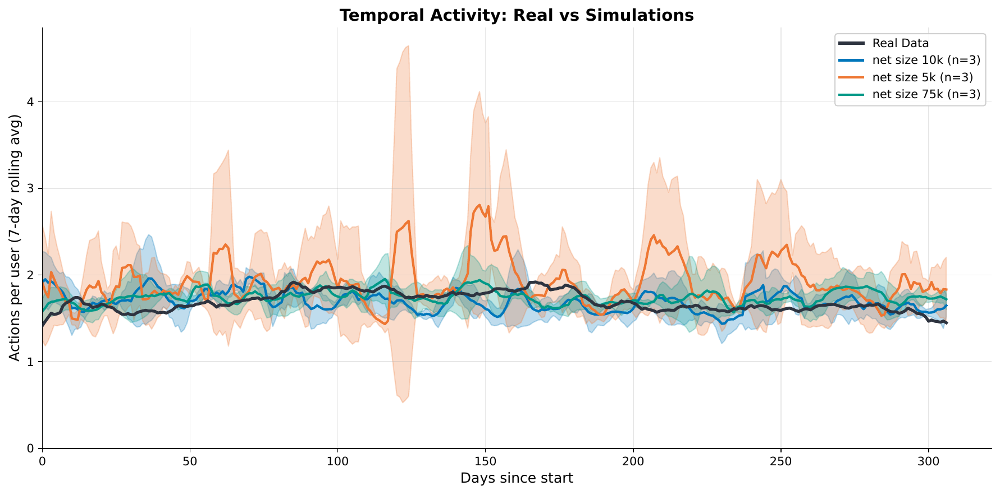
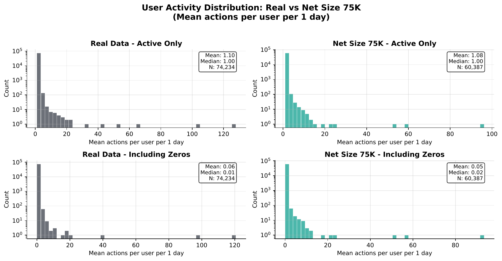

# Social Media Simulator Validation

Analysis suite for comparing synthetic social media data against real-world datasets. This repository contains the validation pipeline for **Phase 1.1** of my research: assessing how well calibrated social media simulators replicate the statistical properties of real user behavior.

## Overview

After calibrating a social media simulator, we need to verify that the synthetic data it produces matches the characteristics of real data. This tool provides:

- **Temporal analysis**: Rolling averages of user activity over time
- **Distribution comparisons**: User activity patterns, total activity per timestep
- **Statistical metrics**: Gini coefficient, burstiness, response times, orphan rates
- **Publication-ready visualizations**: PDF/PNG outputs with confidence intervals
- **Summary tables**: LaTeX and CSV exports for papers

## Installation

```bash
# Clone the repository
git clone <repository-url>
cd social-sim-vs-reality

# Create virtual environment (recommended)
python -m venv venv
source venv/bin/activate  # Linux/macOS
# or: venv\Scripts\activate  # Windows

# Install dependencies
pip install -r requirements.txt
```

### Requirements

- Python 3.9+
- pandas, numpy, matplotlib
- See `requirements.txt` for full list

## Quick Start

```bash
# Run full analysis with default settings
python analyze.py

# Run with verbose output
python analyze.py -v

# Generate only specific plots
python analyze.py --plots temporal user_activity

# Ignore cache and recalculate everything
python analyze.py --no-cache

# List available plot types
python analyze.py --list-plots
```

## Data Format

Since data files are large (excluded from git), you need to provide your own data in the expected format.

### Directory Structure

```
data/
├── real/
│   └── *_dataset.csv          # Real-world data files
└── synthetic/
    ├── net_size_5k_simulation/
    │   ├── run_1.csv
    │   ├── run_2.csv
    │   └── run_3.csv
    ├── net_size_10k_simulation/
    │   └── ...
    └── <simulation_name>_simulation/
        └── run_*.csv
```

### CSV File Format

Both real and synthetic data must follow this schema:

| Column | Type | Description |
|--------|------|-------------|
| `action_id` | string | Unique identifier for the action |
| `timestamp` | datetime/ISO8601 | When the action occurred |
| `author_id` | string | User who performed the action |
| `action_type` | string | Type of action: `"post"` or `"reshare"` |
| `target_action_id` | string | For reshares: ID of the original post (empty for posts) |
| `target_author_id` | string | For reshares: author of the original post (empty for posts) |
| `extra` | list/float | Optional quality/feature values (e.g., `[85.5]`) |

**Example:**

```csv
action_id,timestamp,author_id,action_type,target_action_id,target_author_id,extra
msg_001,2021-01-15 10:30:00+00:00,user_123,post,,,
msg_002,2021-01-15 11:45:00+00:00,user_456,reshare,msg_001,user_123,[72.3]
msg_003,2021-01-15 12:00:00+00:00,user_789,post,,,[91.0]
```

### Converting Simulator Output

If your simulator produces a different format, use the built-in converter:

```bash
# Convert raw simulator output to analysis format
python analyze.py --convert input_dir/ output_dir/

# The converter expects these columns:
# message_id, clock_time (days), user_id, quality, reshared_original_id, reshared_original_user_id
```

The converter will:
1. Rename columns to match the expected schema
2. Convert relative time (days) to absolute timestamps
3. Create `action_type` based on reshare references
4. Scale quality values (configurable via `CONVERTER_QUALITY_SCALE`)

### Automatic Conversion

For convenience, raw simulator files are **automatically converted** when placed in simulation folders. Simply:

1. Copy raw CSV files from your simulator into any `*_simulation/` folder
2. Run `python analyze.py`

The pipeline will detect files with raw simulator columns (not matching `run_*.csv`), convert them to `run_N.csv` format, and delete the originals. This streamlines the workflow when running multiple simulation batches.

## Configuration

All settings are in `settings.py`. Key options:

```python
# Data patterns
REAL_DATA_PATTERN = "*_dataset.csv"
SYNTHETIC_DIR_PATTERN = "*_simulation"

# Temporal analysis
ROLLING_WINDOW_DAYS = 7
TIME_BINNING = "D"  # "D"=daily, "W"=weekly, "H"=hourly

# Plots to generate
PLOTS = {
    "temporal_comparison": True,        # Activity over time with CI
    "user_activity_distribution": True, # Per-user activity histograms
    "total_activity_distribution": True,# Total daily activity
    "inter_event_time": False,          # Time between user actions
    "response_time_boxplot": False,     # Reshare response times
    "quality_kde": False,               # Quality feature distribution
}

# Output formats
FORMAT_TEMPORAL = "pdf"      # Vector for publication
FORMAT_DISTRIBUTION = "pdf"
FORMAT_SCATTER = "png"       # Raster for scatter plots
```

## Output

Running the analysis generates the `output/` folder with all results:

```
output/
├── figures/
│   ├── temporal_comparison.pdf
│   ├── user_activity_*.pdf
│   └── total_activity_*.pdf
├── tables/
│   ├── summary_table.csv
│   └── summary_table.tex
└── metrics/
    ├── real_metrics.json
    └── *_summary.json
```

### Example Visualizations

**Temporal Comparison** — Rolling average of user activity over time, with 95% confidence intervals for simulation runs:



**User Activity Distribution** — Four-panel comparison showing posts, reshares, total actions, and reshare ratio per user:



### Metrics Computed

| Metric | Description |
|--------|-------------|
| `total_actions` | Total number of actions in dataset |
| `total_users` | Number of unique users |
| `orphan_rate` | Fraction of reshares referencing missing posts |
| `reshare_ratio` | Fraction of actions that are reshares |
| `gini_coefficient` | Inequality in user activity (0=equal, 1=concentrated) |
| `burstiness` | Temporal pattern regularity (-1 to 1) |
| `response_time_*` | Statistics on reshare response times |
| `actions_per_user_*` | User activity distribution statistics |

## Project Structure

```
social-sim-vs-reality/
├── analyze.py              # Main entry point
├── settings.py             # Configuration
├── requirements.txt        # Dependencies
├── docs/
│   └── examples/          # Example output figures for README
├── src/
│   ├── config.py          # Configuration loader
│   ├── pipeline.py        # Main validation pipeline
│   ├── data/
│   │   ├── loader.py      # Data loading with caching
│   │   ├── preprocessor.py# Timestamp parsing, cleaning
│   │   └── converter.py   # Simulator format conversion
│   ├── metrics/
│   │   ├── calculator.py  # Metric computation
│   │   ├── activity.py    # Activity distribution metrics
│   │   └── aggregator.py  # Cross-run aggregation
│   ├── visualization/
│   │   ├── base.py        # Matplotlib setup
│   │   ├── temporal.py    # Time series plots
│   │   └── distributions.py# Histogram plots
│   └── export/
│       ├── latex.py       # LaTeX table generation
│       └── json_export.py # JSON metrics export
├── data/                   # [Not in repo - see Data Format]
└── output/                 # [Generated - see Output]
```

## Citation

If you use this tool in your research, please cite:

```bibtex
@software{social_sim_validation,
  title = {Social Media Simulator Validation Suite},
  author = {Verdolotti, Enrico},
  year = {2025},
  url = {https://github.com/...}
}
```

## License

MIT License - see [LICENSE](LICENSE) for details.
